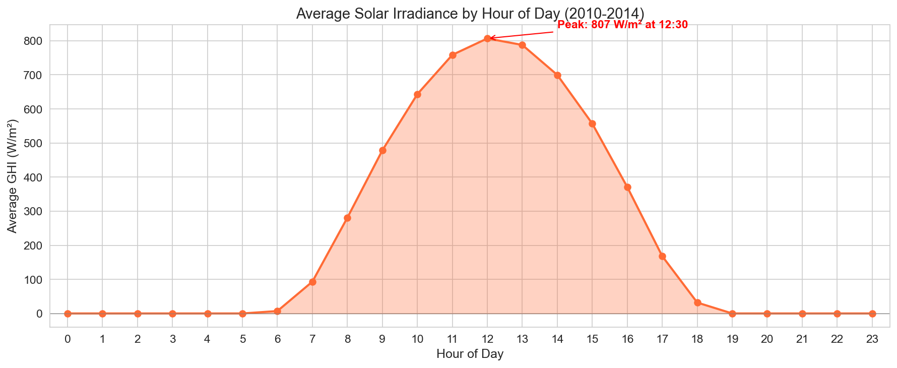
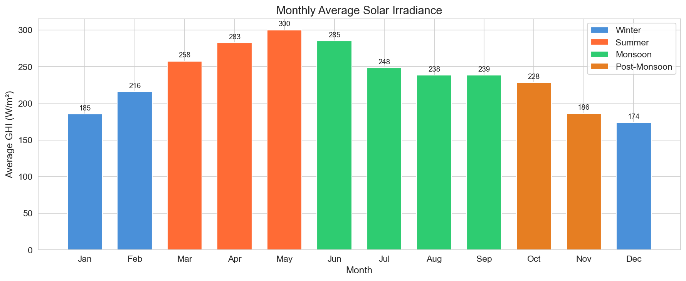
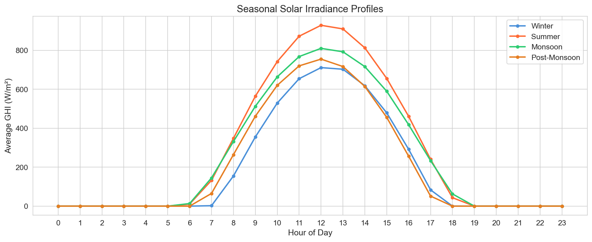
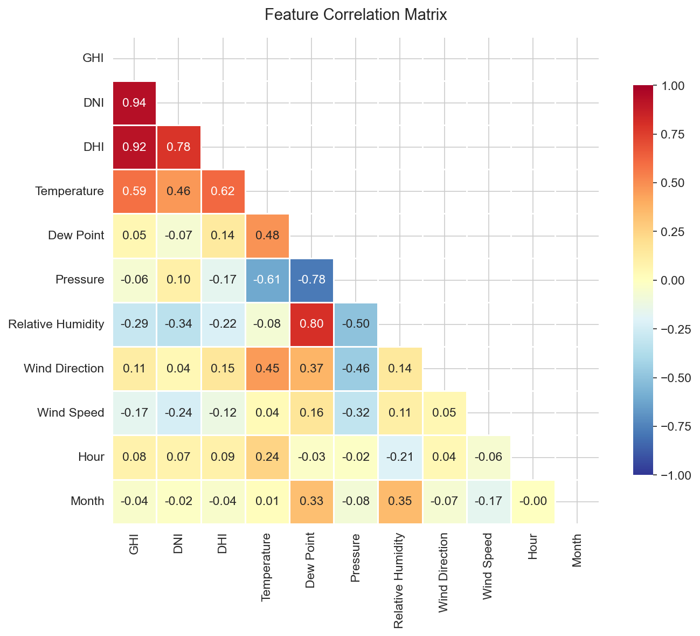
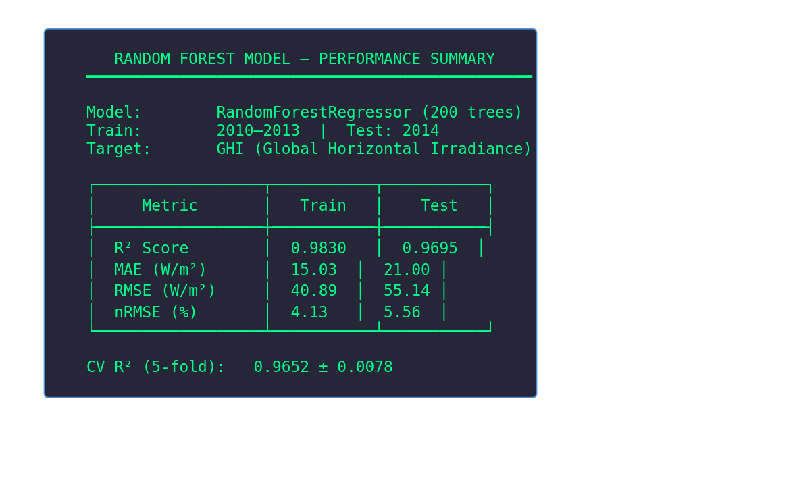
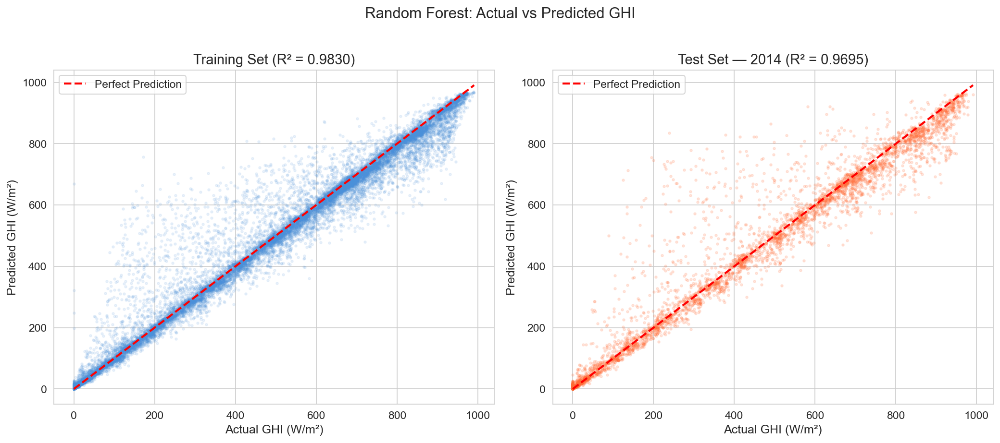
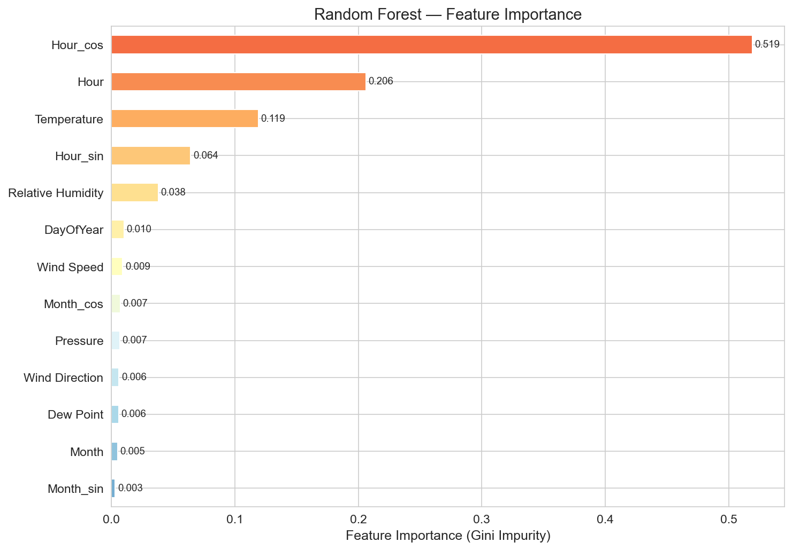
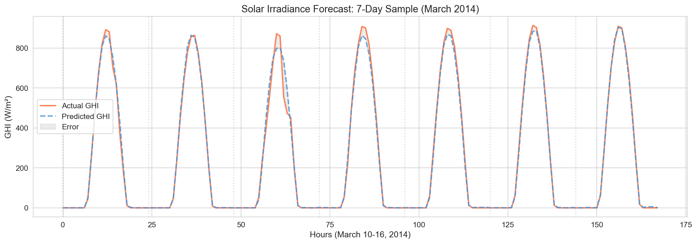

# Forecasting of Renewable Resources Using AI
### PPT Content — Slide-by-Slide Guide
**DOP | BITS Pilani, Hyderabad | EEE Dept | Prof. Arup Ratan**

---

## Slide 1: Title Slide

**Title:** Forecasting of Renewable Resources Using AI

**Subtitle:** Phase 1 — Solar Irradiance Prediction using Random Forest

**Team:** [Your 3 names]

**Course:** Design-Oriented Project (DOP) | Semester: Aug–Dec 2026

**Dept:** Electrical & Electronics Engineering, BITS Pilani, Hyderabad Campus

**Guide:** Prof. Arup Ratan

---

## Slide 2: Problem Statement & Motivation

**Why Solar Forecasting Matters:**
- India's National Solar Mission targets **280 GW** solar capacity by 2030
- Solar energy is intermittent — output depends on weather, time, season
- Accurate forecasting is critical for **grid integration** and **energy planning**
- Poor forecasts lead to grid instability, wasted energy, and financial losses

**Our Goal:**
> Build an AI-based system that predicts **Global Horizontal Irradiance (GHI)** — the total solar radiation received on a horizontal surface — using historical weather data.

**Key Terms:**
| Term | Meaning |
|------|---------|
| GHI | Global Horizontal Irradiance (total solar radiation on flat surface) |
| DNI | Direct Normal Irradiance (direct beam from sun) |
| DHI | Diffuse Horizontal Irradiance (scattered by atmosphere) |
| Relationship | **GHI = DNI × cos(zenith angle) + DHI** |

---

## Slide 3: Literature Review

**Key References:**
1. **"Regression Trees and Solar Radiation Forecasting"** (YouTube lecture, Regression Trees Boosting Bagging study)
   - Compared Random Forest, Bagged Trees, and Boosted Trees
   - RF achieved **28% nRMSE** for 1-hour ahead forecasting
   - Validated RF as a strong baseline for solar prediction

2. **Ahmad et al. (2020)** — "Tree-based ensemble methods for predicting PV power generation"
   - Random Forest outperformed single decision trees by 15-20%
   - Feature importance: Hour of day and temperature are dominant predictors

3. **ML Lifecycle** (Discussed in previous meeting)
   - Data Collection → Preprocessing → Feature Engineering → Model Training → Evaluation → Deployment

> **Note:** Our approach aligns with published research — RF is a proven, strong baseline for solar forecasting before exploring deep learning methods.

---

## Slide 4: System Architecture

**Current (Phase 1) — Static Batch Pipeline:**
```
Excel/CSV Data → Preprocessing → Feature Engineering → Random Forest → Predicted GHI
     ↓                                                        ↓
 Historical         Temperature, Humidity,              Next-day solar
 weather data        Hour, Month, etc.                  irradiance
```

**Future Vision (Phase 4) — Live Pipeline:**
```
Live Weather API → Real-time Pipeline → RF/XGBoost/LSTM → Dashboard
(OpenWeatherMap)    (Automated hourly)   (Model ensemble)   (Web UI)
     ↓                                                        ↓
 Current weather     Auto feature eng.                  Hourly/minutely
 conditions          + data validation                  predictions
```

---

## Slide 5: Dataset Description

**Source:** NASA POWER Database — Rajasthan, India (Solar-rich region)

| Property | Value |
|----------|-------|
| Time Range | 2010–2014 (5 years) |
| Granularity | Hourly (8,760 hours/year) |
| Total Samples | **43,800 rows** |
| Missing Values | **0** (completely clean) |
| Location | Rajasthan, India |

**14 Columns:**
| Category | Features |
|----------|----------|
| Time | Year, Month, Day, Hour, Minute |
| Solar Irradiance | **GHI** (target), DNI, DHI |
| Weather | Temperature, Dew Point, Pressure, Relative Humidity |
| Wind | Wind Direction, Wind Speed |

**Key Statistics:**

| Feature | Mean | Min | Max |
|---------|------|-----|-----|
| GHI (W/m²) | 236.8 | 0 | 991 |
| Temperature (°C) | 28.1 | 4.8 | 51.9 |
| Humidity (%) | 40.7 | 2.8 | 100 |
| Pressure (hPa) | 990.0 | 974.3 | 1006.6 |

---

## Slide 6: EDA — Solar Irradiance Patterns

### Hourly Solar Profile


**Key Insight:** Peak irradiance of **807 W/m²** at solar noon (12:30). Sunrise ~7AM, sunset ~18PM in Rajasthan.

### Monthly Variation


**Key Insight:** **May** has highest average GHI (300 W/m²), **December** lowest (174 W/m²). Summer months receive ~72% more solar energy than winter.

---

## Slide 7: EDA — Seasonal & Correlation Analysis

### Seasonal Profiles


**Key Insight:** Summer peak is **~930 W/m²** vs Winter peak of **~720 W/m²**. Monsoon shows longer daylight hours but cloud-reduced peak.

### Feature Correlations


**Key Insights:**
- GHI strongly correlates with **DNI (0.94)** and **DHI (0.92)** — expected, as GHI = DNI·cos(θ) + DHI
- **Temperature (0.59)** positively correlates — hotter days = more solar radiation
- **Relative Humidity (-0.29)** negatively correlates — clouds/moisture block sunlight
- **Pressure vs Dew Point (-0.78)** — strong inverse relationship (meteorological link)

---

## Slide 8: Data Preprocessing & Feature Engineering

**Steps Performed:**
1. **No missing value imputation needed** — dataset is 100% complete
2. **Feature Engineering:**
   - `DayOfYear` (1–365) — captures seasonal patterns
   - `Hour_sin`, `Hour_cos` — cyclical encoding of hour (so hour 23 is close to hour 0)
   - `Month_sin`, `Month_cos` — cyclical encoding of month
3. **Time-based Train/Test Split:**
   - **Training:** 2010–2013 (35,040 samples)
   - **Testing:** 2014 (8,760 samples)
   - *Why time-based?* Prevents data leakage — model never sees future data

**Why Cyclical Encoding?**
```
Regular:  Hour 23 → 0  (appears as big jump)
Cyclical: sin(2π×23/24) ≈ sin(2π×0/24)  (continuous, smooth transition)
```
This helps Random Forest understand that 11 PM and midnight are close in time.

---

## Slide 9: Model — Random Forest Approach

**What is Random Forest?**
- An **ensemble** of 200 decision trees
- Each tree trains on a random subset of data (**bagging**)
- Each split considers a random subset of features
- Final prediction = **average of all 200 trees**

**Why Random Forest for Solar Forecasting?**
- Handles **non-linear relationships** (temperature ↔ irradiance is non-linear)
- Built-in **feature importance** — tells us which weather variables matter most
- **Robust to outliers** and doesn't require feature scaling
- Proven in literature (28% nRMSE, our reference video)

**Hyperparameters:**
| Parameter | Value | Reason |
|-----------|-------|--------|
| n_estimators | 200 | More trees = more stable predictions |
| max_depth | 20 | Prevents overfitting |
| min_samples_split | 10 | Avoids learning noise |
| min_samples_leaf | 5 | Ensures meaningful leaves |
| max_features | sqrt | Standard for regression |

---

## Slide 10: Results — Model Performance

### Metrics Summary


### Actual vs Predicted


**Talking Points:**
- **R² = 0.9695** — model explains **96.95%** of variance in solar irradiance
- **MAE = 21 W/m²** — average error is only 21 watts per square meter
- **nRMSE = 5.56%** — significantly better than the literature baseline of 28%
- **Train-test gap is small** (0.9830 vs 0.9695) — model is **not overfitting**
- **5-fold CV R² = 0.9652 ± 0.0078** — model is consistent and stable

---

## Slide 11: Results — Feature Importance & Forecast Demo

### What Drives Solar Irradiance?


**Key Finding:** **Time of day (Hour)** contributes **79%** of prediction power, followed by **Temperature (12%)**. This makes physical sense — solar position determines irradiance.

### 7-Day Forecast Sample


**Key Finding:** The model accurately tracks the daily solar cycle for an entire week. Predictions closely follow actual measurements, including variations in peak irradiance across days.

---

## Slide 12: Semester Roadmap

```
Phase 1 (Week 1-3) ← CURRENT — COMPLETED
├── Static CSV + Random Forest baseline
├── Next-day irradiance prediction
├── R² = 0.9695, nRMSE = 5.56%
└── Deliverable: Working baseline ✓

Phase 2 (Week 4-6)
├── Hourly granularity predictions
├── Compare RF vs XGBoost vs Gradient Boosting
├── Time-series cross-validation
└── Deliverable: Model comparison report

Phase 3 (Week 7-9)
├── Live weather API integration (OpenWeatherMap / NASA POWER API)
├── Real-time data pipeline for Hyderabad
├── Automated hourly/minutely predictions
└── Deliverable: Live prediction pipeline

Phase 4 (Week 10-12)
├── LSTM / hybrid model comparison
├── Interactive dashboard / web interface
├── Hyderabad campus-specific predictions
├── Final report + live demo
└── Deliverable: Complete system with UI
```

---

## Slide 13: Next Steps (Phase 2 Preview)

**Immediate Next Steps:**
1. **Model Comparison:** XGBoost, Gradient Boosting, Support Vector Regression
2. **Hyperparameter Optimization:** GridSearchCV / RandomizedSearchCV
3. **Advanced Feature Engineering:**
   - Lag features (previous hour's GHI as input)
   - Rolling averages (3-hour, 6-hour moving averages)
   - Clear-sky index normalization
4. **Hourly Predictions:** Move from daily to hourly granularity
5. **Hyderabad Data:** Fetch from NASA POWER API for campus-specific model

**Questions for Sir:**
- Should we focus on Hyderabad-specific data or keep Rajasthan as baseline?
- Priority: model comparison (XGBoost etc.) or live API integration first?
- Any specific metrics or benchmarks to target?

---

## Slide 14: Thank You & Q&A

**Summary:**
- Built a Random Forest model achieving **R² = 0.97** on unseen data
- Identified Hour of Day and Temperature as key predictors
- nRMSE of **5.56%** — well below literature baseline of 28%
- Clear semester roadmap from static CSV to live predictions

**GitHub / Code:** [Link to your repo if applicable]

**References:**
1. YouTube: "Regression Trees and Solar Radiation Forecasting" (Boosting, Bagging, Ensemble)
2. NASA POWER Database (data source)
3. scikit-learn RandomForestRegressor documentation
